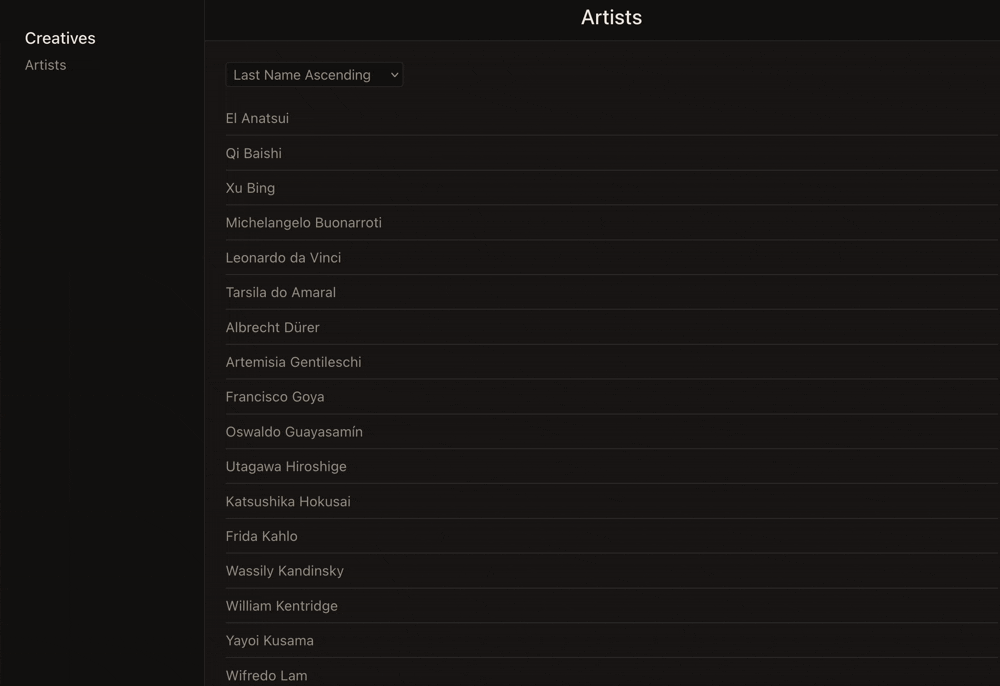

# react-ios-nav

A React implementation of iOS-style hierarchical navigation — split-view layout, 
directional push/pop transitions, and a responsive mobile menu.

## Tech Stack
- React
- React Router
- Framer Motion

Originally developed to prototype iOS navigation conventions on the web, later 
refined across other projects. Adapted here as a standalone demo with an artist 
catalog as illustrative data.

**The interesting part:** `SplitNavSection` tracks navigation history and computes 
a direction — left, right, or lateral — for every route change, so `SplitNavView` 
can animate content the way iOS does: push forward, pop back, no guesswork. The 
same route tree drives both the desktop split-view and the collapsed mobile menu — 
no separate mobile routes. `InfiniteScroll<T>` is a fully generic, typed component 
that takes a paginated getter and a render function — drop it into any list.

## Running locally

`npm install` 
`npm run dev`