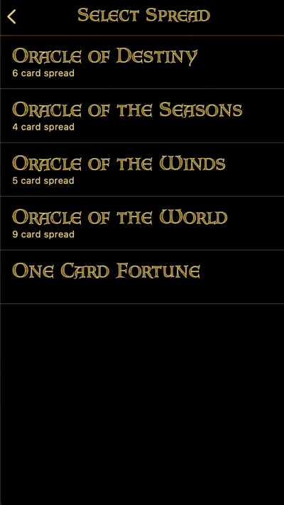

# Swift Reading Layout

A data-driven card layout engine for the Madame Endora iOS app.

## The Problem
Device size, orientation, and spread type all varied, and each spread needed its cards as large as possible within whatever space remained.

## The Solution
`ReadingLayout` derives every position and dimension mathematically from a spread's grid definition rather than from fixed
values. Adding a new spread means defining its grid — no layout code changes.

## File Inventory
- `ReadingLayout.swift` is the engine.
- `ReadingLayoutSimpleMathExtension.swift` isolates the math as small, pure functions.
- `GridLocation.swift` & `XYGridLocation.swift` are the grid-position data model.
- `ReadingLayoutConstraintExtension.swift` & `ReadingViewControllerSetSpreadPositionsExtension.swift` apply it as real NSLayoutConstraints.

## Tech Stack
- Swift

## Complete Product
Built for [Madame Endora's Fortune Cards](https://apps.apple.com/ca/app/madame-endora/id1625731386), shipped to the App Store.